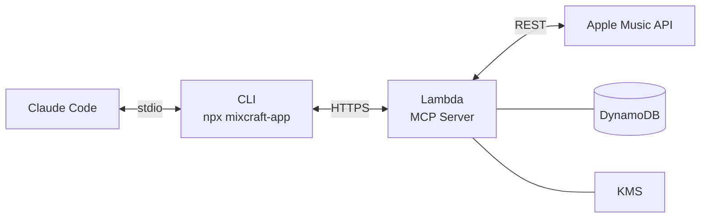

# Mixcraft

Give Claude access to your music library. Mixcraft is a hosted MCP server that connects Claude Code to Apple Music, letting Claude search your library, build playlists, and learn your taste over time.

**[mixcraft.app](https://mixcraft.app)** — set up in 60 seconds.

## Quick Start

### 1. Get an API key

Visit [mixcraft.app](https://mixcraft.app), sign in, connect your Apple Music account, and create an API key.

### 2. Set your API key

Add this to your shell profile (`.bashrc`, `.zshrc`, etc.):

```bash
export MIXCRAFT_API_KEY="mx_your_key_here"
```

### 3. Install the plugin

The Mixcraft plugin gives Claude both the MCP tools and a playlist assistant skill that teaches it how to curate great playlists and remember your preferences.

```
/plugin marketplace add schuettc/mixcraft-app
/plugin install mixcraft@mixcraft-app
```

Restart Claude Code to activate the plugin.

### 4. Use it

Just ask Claude about music:

- "Make me a playlist for a long drive"
- "What have I been listening to lately?"
- "Add some new songs to my workout playlist"
- "Find me something like Radiohead but more electronic"
- "I need focus music for coding"

## What You Get

### MCP Tools

| Tool | Description |
|------|-------------|
| `search_catalog` | Search songs, albums, and artists |
| `list_playlists` | List your library playlists |
| `get_playlist_tracks` | Get tracks in a playlist |
| `create_playlist` | Create a new playlist |
| `add_tracks` | Add tracks to a playlist |
| `get_recently_played` | Recent listening history |
| `get_library_songs` | Songs in your library |
| `add_to_library` | Add songs or albums to your library |

### Playlist Assistant Skill

The plugin includes a skill that teaches Claude to be a thoughtful music companion:

- **Knows your taste** — checks your recently played and library before recommending anything
- **Curates intentionally** — builds playlists with energy arcs, genre bridges, and a mix of familiar favorites and new discoveries
- **Remembers preferences** — stores your likes, dislikes, and listening contexts in `.claude/mixcraft.local.md` so future sessions build on past ones
- **Respects constraints** — Apple Music playlists created via API can't be deleted, and tracks can't be removed. Claude always confirms before writing.

## Alternative: Manual MCP Setup

If you prefer not to use the plugin, you'll still need an API key from [mixcraft.app](https://mixcraft.app). Then add this to your `.mcp.json`:

```json
{
  "mcpServers": {
    "mixcraft": {
      "command": "npx",
      "args": ["-y", "mixcraft-app@latest"],
      "env": {
        "MIXCRAFT_API_KEY": "mx_your_key_here"
      }
    }
  }
}
```

This gives you the MCP tools without the playlist assistant skill.

## Architecture



### Packages

| Package | Description |
|---------|-------------|
| `packages/cli` | `npx mixcraft-app` — stdio-to-HTTP MCP proxy ([npm](https://www.npmjs.com/package/mixcraft-app)) |
| `packages/server` | Hosted MCP server (Lambda) |
| `packages/portal` | Web portal at [mixcraft.app](https://mixcraft.app) (React + Vite) |
| `packages/portal-api` | Portal backend (Lambda) |
| `packages/infra` | AWS CDK infrastructure |
| `packages/plugin` | Claude Code plugin with playlist assistant skill |

## Development

```bash
pnpm install
pnpm -r build
```

### Local portal dev

```bash
cd packages/portal && pnpm dev  # runs on port 3000
```

### Deploy

```bash
AWS_PROFILE=playlists aws sso login
cd packages/infra && AWS_PROFILE=playlists npx cdk deploy --all
```

## License

MIT
