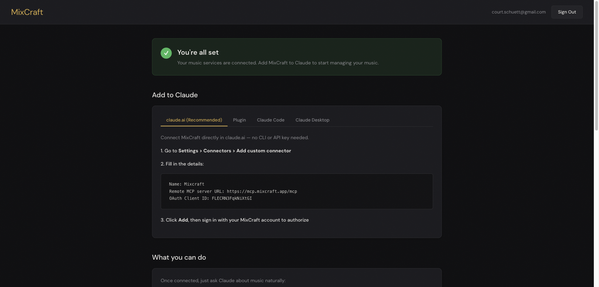
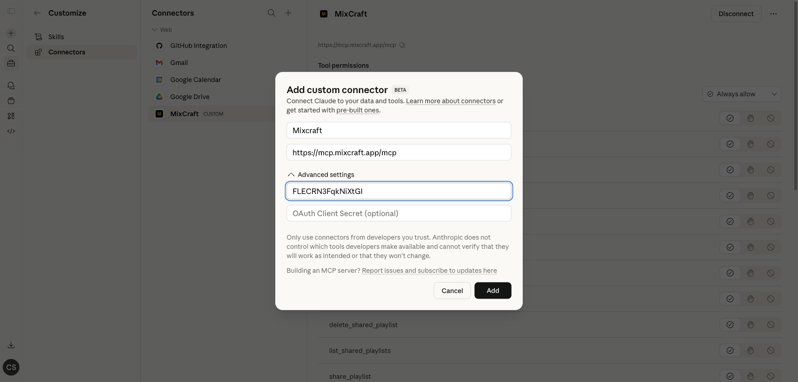
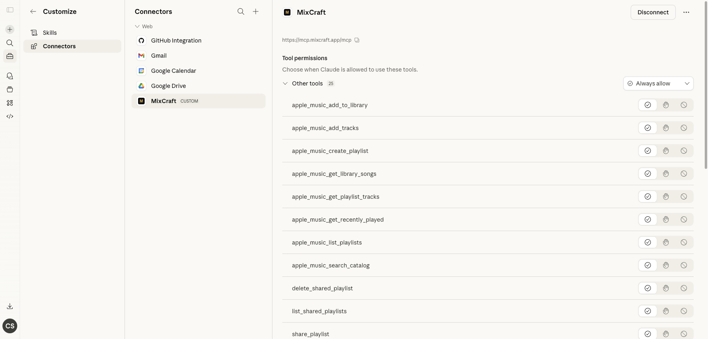

# MixCraft

Give Claude access to your music library. MixCraft is a hosted MCP server that connects Claude to Apple Music and Spotify, letting Claude search your library, build playlists, and learn your taste over time.

**[mixcraft.app](https://mixcraft.app)** — set up in 60 seconds.



## Quick Start

### 1. Connect your music

Visit [mixcraft.app](https://mixcraft.app), sign in, and connect your music service (Apple Music, Spotify, or both).

### 2. Add MixCraft to Claude

#### claude.ai (Recommended)

Add MixCraft as a connector directly — no CLI or API key needed:

1. Go to **Customize > Connectors > + > Add custom connector**
2. Fill in:
   - **Name**: `Mixcraft`
   - **Remote MCP server URL**: `https://mcp.mixcraft.app/mcp`
3. Expand **Advanced settings** and add:
   - **OAuth Client ID**: `FLECRN3FqkNiXtGI`
4. Click **Add**, then sign in with your MixCraft account to authorize



Once connected, MixCraft appears in your connectors with all available tools:



#### Claude Code Plugin

The MixCraft plugin gives Claude both the MCP tools and a playlist assistant skill that teaches it how to curate great playlists and remember your preferences.

```
/plugin marketplace add schuettc/mixcraft-app
/plugin install mixcraft@mixcraft-app --scope project
```

Set your API key in your shell profile (`.bashrc`, `.zshrc`, etc.):

```bash
export MIXCRAFT_API_KEY="mx_your_key_here"
```

Restart Claude Code to activate the plugin.

#### Claude Code (MCP only)

Add to your project's `.mcp.json` (replace `mx_your_key_here` with your API key from [mixcraft.app](https://mixcraft.app)):

```json
{
  "mcpServers": {
    "mixcraft": {
      "command": "npx",
      "args": ["-y", "mixcraft-app@latest"],
      "env": {
        "MIXCRAFT_API_KEY": "mx_your_key_here"
      }
    }
  }
}
```

#### Claude Desktop

Add to your config file (replace `mx_your_key_here` with your API key):

- **macOS**: `~/Library/Application Support/Claude/claude_desktop_config.json`
- **Windows**: `%APPDATA%\Claude\claude_desktop_config.json`

```json
{
  "mcpServers": {
    "mixcraft": {
      "command": "npx",
      "args": ["-y", "mixcraft-app@latest"],
      "env": {
        "MIXCRAFT_API_KEY": "mx_your_key_here"
      }
    }
  }
}
```

### 3. Use it

Just ask Claude about music:

- "Make me a playlist for a long drive"
- "What have I been listening to lately?"
- "Add some new songs to my workout playlist"
- "Find me something like Radiohead but more electronic"
- "I need focus music for coding"

## What You Get

### MCP Tools

Tools are registered based on which services you've connected. When both Apple Music and Spotify are connected, tools are prefixed (`apple_music_*`, `spotify_*`) so Claude knows which service to use.

**Shared tools** (available for both services):

| Tool | Description |
|------|-------------|
| `search_catalog` | Search songs, albums, and artists |
| `list_playlists` | List your library playlists |
| `get_playlist_tracks` | Get tracks in a playlist |
| `create_playlist` | Create a new playlist |
| `add_tracks` | Add tracks to a playlist |
| `get_recently_played` | Recent listening history |
| `get_library_songs` | Songs in your library |
| `add_to_library` | Add songs or albums to your library |

**Spotify-only tools** (registered only when Spotify is connected):

| Tool | Description |
|------|-------------|
| `remove_playlist` | Remove (unfollow) a playlist |
| `remove_tracks_from_playlist` | Remove specific tracks from a playlist |
| `reorder_playlist_tracks` | Reorder tracks in a playlist |
| `update_playlist` | Rename, update description, or change visibility |
| `remove_from_library` | Remove songs or albums from your library |
| `get_top_items` | Your top artists or tracks by listening history |

### Playlist Assistant Skill

The plugin includes a skill that teaches Claude to be a thoughtful music companion:

- **Knows your taste** — checks your recently played and library before recommending anything
- **Curates intentionally** — builds playlists with energy arcs, genre bridges, and a mix of familiar favorites and new discoveries
- **Remembers preferences** — stores your likes, dislikes, and listening contexts in `.claude/mixcraft.local.md` so future sessions build on past ones
- **Service-aware** — knows the differences between Apple Music and Spotify (e.g., Apple Music playlists can't be deleted via API, Spotify's can) and adjusts behavior accordingly

## How It Works

MixCraft runs as a hosted service so you don't need to manage developer credentials or run any servers.

```
claude.ai  <--HTTPS-->  MixCraft API  <--REST-->  Apple Music / Spotify
Claude Code / Desktop  <--stdio-->  CLI (npx mixcraft-app)  <--HTTPS-->  MixCraft API
```

1. You connect your music service at [mixcraft.app](https://mixcraft.app) — Apple Music via MusicKit OAuth, Spotify via direct OAuth
2. Your music service tokens are encrypted with AWS KMS and stored in DynamoDB — MixCraft never sees or stores tokens in plaintext
3. **claude.ai** authenticates via OAuth 2.0 with PKCE — sign in once and the connector handles the rest
4. **Claude Code / Desktop** authenticate via API key — create one at [mixcraft.app](https://mixcraft.app) and set it as `MIXCRAFT_API_KEY`
5. When Claude calls a tool, the request hits the MixCraft API which decrypts your token, calls the appropriate music service, and returns the results
6. Spotify tokens are automatically refreshed when they expire — no re-authorization needed

For more details on security and data handling, see [SECURITY.md](docs/SECURITY.md).

## License

MIT
